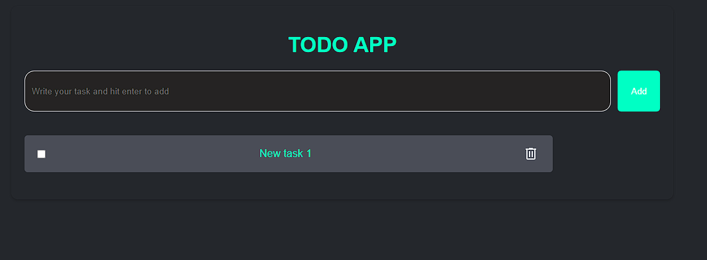

# Simple Todo App
A simple Todo app built with only DOM manipulation and CSS.

## Project Description
This project is a basic Todo app that allows users to add, mark as complete, and delete tasks. The entire app is built using plain HTML, CSS, and JavaScript, focusing on DOM manipulation without the use of external libraries or frameworks.

## Features
* Add new tasks to the Todo list.
* Mark tasks as complete or incomplete.(still not complete)
* Delete tasks from the list.
* Responsive and clean user interface.

## Installation
To run this project locally, clone the repository and open the index.html file in your web browser.

```bash
git clone https://github.com/Adlichalbi/TODO-App.git
cd simple-todo-app
open index.html
```

## Usage
1. Type a task into the input field and press "Enter" or click the "Add" button to add it to the list.
2. Click on a task to mark it as complete. Click again to unmark it.
3. Use the delete button next to each task to remove it from the list.

## Technologies Used
* HTML: For structuring the Todo app.
* CSS: For styling and layout.
* JavaScript: For managing tasks through DOM manipulation.

## Screenshot


## License
This project is open source and available under the MIT License.

## Contact
If you have any questions or suggestions, feel free to reach out.

